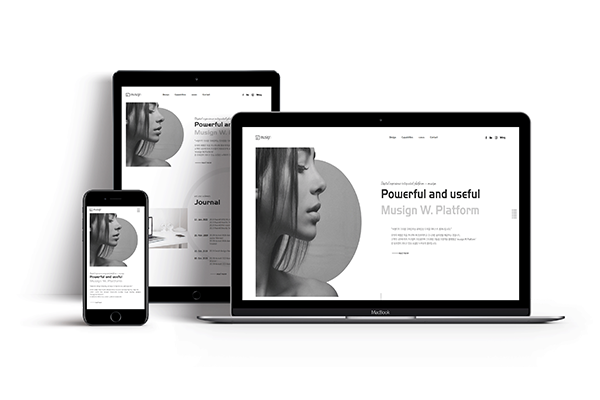
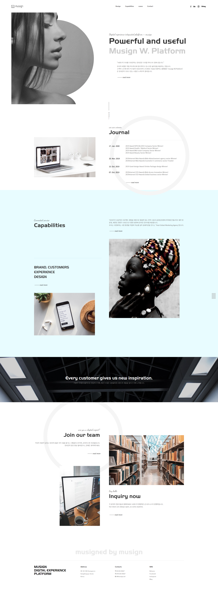

# 📌 Musign 클론코딩

### 에이전시 뮤자인

## 💻 Clone Coding 
**웹 에이전시 뮤자인의 클론코딩 웹사이트입니다.** GD WEB(지디웹) 선정작이며 반응형으로 제작하였습니다.   
심플한 디자인과 구조화되었지만 깔끔한 레이아웃으로, HTML 마크업과 CSS 디자인 코드 연습에 적합하다고 생각합니다. 
  Scrolla.js를 적용했으며, jQuery로 100vw, 100vh를 차지하는 오픈 메뉴를 구현하고 scrollTop() 메소드를 사용한 애니메이션을 구현했습니다.

 

### 👀 클론코딩 사이트 보기 (Click to View) 
👉 <https://breeghty.github.io/Musign_clonecoding/>

 

### ✔ 작업일자(Date)
2022.10.

 

### ✔ 키워드(Keyword)
- 클론코딩 100%
- 웹표준, 웹접근성, 반응형웹
- HTML, CSS, Javascript, jQuery
- scrollTop(), 100vh 오픈 메뉴, GD WEB(지디웹) 선정작

 

### ✔ 풀페이지(Full page)

